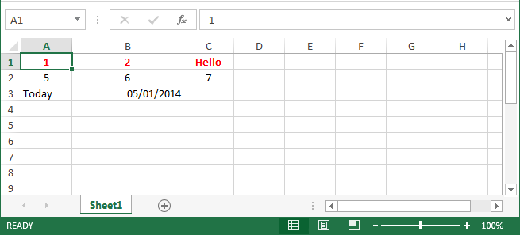

## ExcelBuilder - A Groovy Builder for Excel Spreadsheets

This provides a builder-style interface for creating Excel (2007+ format) spreadsheets using the Apache POI library.

The documentation is currently ... sparse. But the unit tests provide many examples of how to use it.
To give you an idea of the main features here is a quick example:

	def builder = new ExcelBuilder()
	builder {
		font('title') {
			bold = true
			color = IndexedColors.RED.index
		}
		style('centred') {
			alignment = CellStyle.ALIGN_CENTER
		}
		style('uk-date') {
			dataFormatString = 'dd/mm/yyyy'
		}
		sheet {
			row([1, 2, 'Hello'], style: ['centred', 'title'])
			row([5, 6, 7], style: 'centred')
			row(['Today', new Date()]) {
				cell(column: 1, style: 'uk-date', width: 20)
			}
		}
	}
	builder.workbook.write(new FileOutputStream(new File('test.xlsx')))

This produces a workbook with a sheet that looks something like this:

There are more features to come, but it's fully functional right now.

ExcelBuilder is licensed under a BSD-style licence.

> Copyright &copy; 2013, 2014 Neil Winton (neil@winton.org.uk)
> All rights reserved.
>
> Redistribution and use in source and binary forms, with or without modification,
> are permitted provided that the following conditions are met:
>
> 1. Redistributions of source code must retain the above copyright notice, this
> list of conditions and the following disclaimer.
>
> 2. Redistributions in binary form must reproduce the above copyright notice,
> this list of conditions and the following disclaimer in the documentation and/or
> other materials provided with the distribution.
>
> THIS SOFTWARE IS PROVIDED BY THE COPYRIGHT HOLDERS AND CONTRIBUTORS "AS IS" AND ANY
> EXPRESS OR IMPLIED WARRANTIES, INCLUDING, BUT NOT LIMITED TO, THE IMPLIED WARRANTIES
> OF MERCHANTABILITY AND FITNESS FOR A PARTICULAR PURPOSE ARE DISCLAIMED. IN NO EVENT
> SHALL THE COPYRIGHT HOLDER OR CONTRIBUTORS BE LIABLE FOR ANY DIRECT, INDIRECT, INCIDENTAL,
> SPECIAL, EXEMPLARY, OR CONSEQUENTIAL DAMAGES (INCLUDING, BUT NOT LIMITED TO, PROCUREMENT
> OF SUBSTITUTE GOODS OR SERVICES; LOSS OF USE, DATA, OR PROFITS; OR BUSINESS INTERRUPTION)
> HOWEVER CAUSED AND ON ANY THEORY OF LIABILITY, WHETHER IN CONTRACT, STRICT LIABILITY, OR
> TORT (INCLUDING NEGLIGENCE OR OTHERWISE) ARISING IN ANY WAY OUT OF THE USE OF THIS SOFTWARE,
> EVEN IF ADVISED OF THE POSSIBILITY OF SUCH DAMAGE.